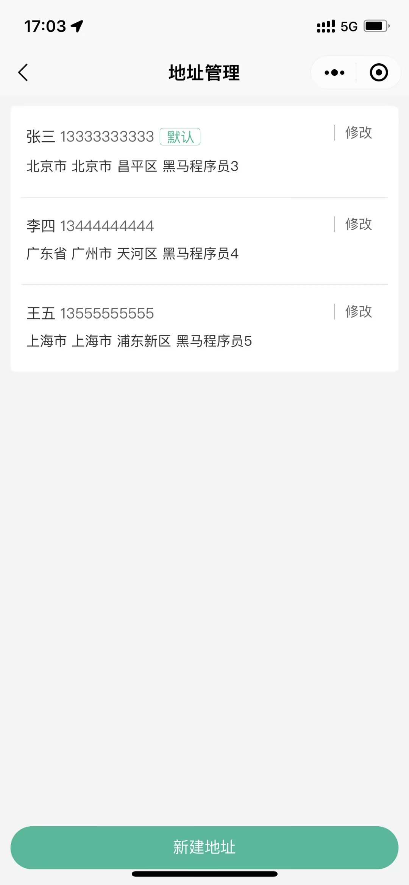
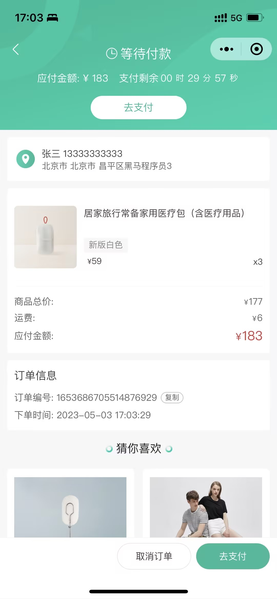

## 技术栈

(主)：uniapp + vue@3 + ts + pinia + uni-ui + scss + eslint + husky

(次)：lint-staged（只对git缓存区的代码进行eslint代码规范检验） + pinia-plugin-persistedstate（数据持久化）

### uniapp + ts 配置

- @dcloudio/types **uni-app 内置 API 类型**
- @uni-helper/uni-app-types **uni-app 内置组件的 TypeScript 类型定义文件**
- @uni-helper/uni-ui-types **提供 uni-ui 组件 TypeScript 类型**
- @uni-helper/uni-cloud-types **提供 uni-cloud 组件类型**
- miniprogram-api-typings **原生微信小程序类型 API 的 TypeScript 类型定义文件** 
- ...

```js
tsconfig.json

"compilerOptions": {
  ...
  // 只有其中列出的模块才会自动加入编译
  "types": [
    "@dcloudio/types",
    "@uni-helper/uni-app-types",
    "@uni-helper/uni-ui-types",
    "miniprogram-api-typings",
  ]
},
```

### 推荐
- [uni-helper](https://github.com/uni-helper) 虽然是非官方组织，但这个第三方组织是 uni-app 生态类型声明文件做的非常好，更新频率也非常及时

- UI库：[uv-ui](https://www.uvui.cn/)。uv-ui 可以通过 [ttou/uv-typings](https://www.npmjs.com/package/@ttou/uv-typings) 提供 ts 支持


### 封装 uni.request + uni.addInterceptor 请求拦截器
```js
// 添加拦截器
const httpInterceptor: UniApp.InterceptorOptions = {
  invoke(options: UniApp.RequestOptions) {
    // 1. 非 http 开头需拼接地址
    if (!options.url.startsWith('http')) {
      options.url = baseURL + options.url;
    }

    // 2. 请求超时, 默认 60s
    options.timeout = 10000;
    
    // 3. 添加小程序端请求头标识
    options.header = {
      ...options.header,
      'source-client': 'miniapp',
    };
    
    // console.log(options);
    // 4. 添加 token 请求头标识
    const memberStore = useMemberStore();
    const userToken = memberStore.userToken;
    userToken && (options.header.Authorization = userToken);
  }
};

uni.addInterceptor('request', httpInterceptor);
uni.addInterceptor('uploadFile', httpInterceptor);

interface IResponse<T> {
  code: string;
  msg: string;
  result: T;
}

// 请求方法
type ReqMethod = 'OPTIONS' | 'GET' | 'HEAD' | 'POST' | 'PUT' | 'DELETE' | 'TRACE' | 'CONNECT';

const httpRequest = <T = any>(url = '', data = {}, method: string = 'get', otherConfig = {}): Promise<IResponse<T>> => {
  return new Promise((resolve, reject) => {
    uni.request({
      url,
      method: method.toUpperCase() as ReqMethod,
      data,
      ...otherConfig,
      // 响应成功
      success(res) {
        // console.log(res);
        // 状态码 2xx， axios 就是这样设计的
        if (res.statusCode >= 200 && res.statusCode < 300) {
          resolve(res.data as IResponse<T>);
          // 401错误  -> 清理用户信息，跳转到登录页
        } else if (res.statusCode === 401) {
          const memberStore = useMemberStore();
          memberStore.clearProfile();
          uni.navigateTo({ url: '/pages/login/login' });
          
          reject(res);
        } else {
          // 其他错误 -> 根据后端错误信息轻提示
          uni.showToast({
            icon: 'none',
            title: (res.data as IResponse<T>).msg || '请求错误',
          });
          
          reject(res);
        }
      },
      // 响应失败
      fail(error) {
        uni.showToast({ icon: 'none', title: '网络错误，换个网络试试' });
        reject(error);
      }
    });
  });
};

export default httpRequest;
```

### pinia-plugin-persistedstate uniapp 中修改 storage 存储 方式
```js
import { createPinia } from 'pinia';
// import piniaPluginPersistedstate from 'pinia-plugin-persistedstate';
import { createPersistedState } from 'pinia-plugin-persistedstate';

// 创建 pinia 实例
const pinia = createPinia();
// 使用持久化存储插件
// pinia.use(piniaPluginPersistedstate);
pinia.use(createPersistedState({
  storage: {
    getItem: uni.getStorageSync,
    setItem: uni.setStorageSync,
  }
}));

// 默认导出，给 main.ts 使用
export default pinia;

// 模块统一导出
export * from './modules/memberModule';
```

### 微信小程序分包 + 预下载
```js
// 分包加载
"subPackages": [
  {
    // 子包的根目录
    "root": "pages/module-goods",
    "pages": [
      {
        "path": "goods-hot/goods-hot",
        "style": {
          "navigationBarTitleText": "热门推荐"
        }
      },
    ]
  }
],
// 分包预下载规则
"preloadRule": {
  "pages/tabbar/profile/profile": {
    "network": "all",
    "packages": [
      "pages/module-profile"
    ]
  }
}
```

### 成果展示

<div  align="center">    
  <!--  -->
  
  
  
  
  
  <!--  -->
  <!--  -->
  
  
  
  <!--  -->
</div>
